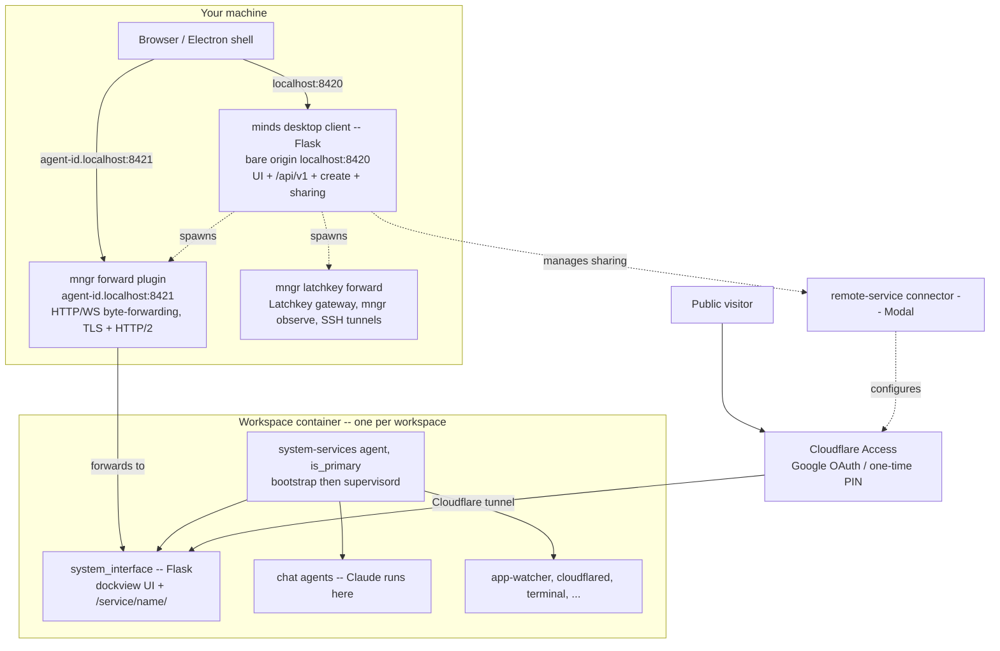

# minds architecture overview

minds is a desktop app for running persistent, autonomous Claude agents. Each
agent -- a **workspace** -- runs in its own container (local Docker or Lima, or
a remote VM / cloud host) and is created from a template git repository. You
reach every workspace through one local desktop client, and can optionally
expose individual services to the public internet through a Cloudflare tunnel.

This document maps how the pieces fit together. For deeper dives, see
[Where to go next](#where-to-go-next).

## Mental model

A workspace is a persistent `mngr` agent. The template repository it is created
from (by default
[default-workspace-template](https://github.com/imbue-ai/default-workspace-template))
defines the agent's entire runtime -- its Dockerfile, background services,
skills, and `mngr` configuration in `.mngr/settings.toml`. There is no
`minds.toml` and no vendoring: the template repo is the single source of truth
for what a workspace is.

You interact with a workspace through a web UI (the dockview interface served
from inside the container). The desktop client's only jobs are to authenticate
you and route your browser to the right workspace; it never defines what a
workspace does or how it responds.

## Architecture at a glance

Three layers, running in different places:



### 1. On your machine: the desktop client

`minds run` (`apps/minds/imbue/minds/cli/run.py`) starts everything local. It is
a **Flask** app served by a synchronous cheroot WSGI server
(`desktop_client/server.py`), and it does three jobs:

- **Serves the minds UI** on the "bare origin"
  `http://127.0.0.1:8420/` (`DEFAULT_DESKTOP_CLIENT_PORT`,
  `config/data_types.py`): the landing page, the workspace-creation form,
  account and settings pages, the sharing editor, and the `/api/v1` JSON API
  (`desktop_client/app.py`).
- **Spawns `mngr forward`** as a subprocess (the `mngr_forward` plugin,
  `libs/mngr_forward/`). This is what actually byte-forwards HTTP and WebSocket
  traffic from `https://<agent-id>.localhost:8421/*` to each workspace's own
  `system_interface`, over TLS + HTTP/2 (default port 8421,
  `mngr_forward/config.py`). The desktop client itself has no
  subdomain-forwarding or proxy route -- it byte-forwards nothing.
- **Spawns / adopts a `mngr latchkey forward` supervisor** that owns the shared
  Latchkey gateway, a single `mngr observe` discovery producer, and the
  per-agent reverse SSH tunnels. It is restarted on every `minds run` and
  deliberately left running when minds shuts down.

When packaged, minds ships as an Electron app (see
[desktop-app.md](./desktop-app.md)); the Electron shell wraps this same Python
backend unchanged.

**Discovery.** The `mngr forward` plugin tails the shared `mngr observe`
discovery feed and spawns one `mngr event <agent-id> services requests --follow
--quiet` per matching agent, emitting JSONL envelopes. The desktop client's
`EnvelopeStreamConsumer` (`desktop_client/forward_cli.py`) consumes those
envelopes and updates its backend resolver, so newly created workspaces and
newly registered services appear without a restart.

### 2. In the container: the workspace

Each workspace is created with `mngr create` and consists of more than one
`mngr` agent:

- The **primary "services" agent** (`mngr` name `system-services`, carrying the
  label `is_primary=true`) runs only bootstrap and the background services. Its
  tmux window 0 is `sleep infinity && claude`, so Claude never actually starts
  there -- the trailing `&& claude` is deliberately unreachable. It is hidden
  from the workspace's agent list and protected from direct destroy.
- One or more **chat agents** are separate `mngr` agents where Claude actually
  runs. The bootstrap creates the first one on initial boot (gated by
  `runtime/initial_chat_created`) and writes `CLAUDE_CONFIG_DIR` into the host
  env file, so every agent on the host shares the services agent's Claude config
  -- auth, plugins, and sessions are set up once and inherited.

The primary agent's bootstrap (`uv run bootstrap`) runs first-boot setup and
then execs `supervisord -n`, which supervises the background services declared
as `[program:*]` sections in `supervisord.conf` (logs under
`/var/log/supervisor`). Those services include:

- **`system_interface`** -- a Flask app that serves the dockview single-page UI
  at `/` and multiplexes the workspace's local services under
  `/service/<name>/...` (Service Worker prefix bootstrap, HTML and cookie
  rewriting, and WebSocket bridging all happen here, not in the desktop client).
- **`app-watcher`** -- watches `runtime/applications.toml` and appends
  `service_registered` / `service_deregistered` events to
  `$MNGR_AGENT_STATE_DIR/events/services/events.jsonl`, which is how the desktop
  client discovers a workspace's live services.
- **`cloudflared`** -- watches `runtime/secrets/cloudflare_tunnel.env` for a
  tunnel token and runs the Cloudflare tunnel when one is present (a no-op until
  then).
- plus `terminal`, `host-backup`, `earlyoom`, a one-shot `deferred-install`
  (installs Playwright's Chromium and its apt libraries once per boot), and
  `browser`.

Services register their ports by calling `scripts/forward_port.py`, which
upserts `{name, url}` entries into `runtime/applications.toml`. All of this
container-side code lives in the template repo, not in `apps/minds` (see the
[workspace docs](./workspace/README.md)).

### 3. Authentication

Local minds uses three independent credentials, plus a separate account
identity:

1. **`minds_session`** -- an `itsdangerous`-signed cookie minted after you
   consume a one-time login code (printed as a login URL in the terminal when
   `minds run` starts). It guards the local minds UI on the bare origin. It is
   host-only (scoped to `localhost:8420`), deliberately *not* `Domain=localhost`
   -- browsers treat `localhost` as a public suffix and refuse to send such
   cookies to subdomains (`desktop_client/app.py`).
2. **`mngr_forward_session`** -- a separate cookie the `mngr forward` plugin
   mints for each `<agent-id>.localhost` subdomain via its `/goto/<agent-id>/`
   auth bridge. The Electron shell pre-sets it from the `mngr_forward_started`
   event minds emits at startup.
3. **`MINDS_API_KEY`** -- a per-run in-memory bearer token injected by the
   Latchkey gateway's bundled `minds-api-proxy` extension, so in-container
   agents can call the minds `/api/v1` surface.

Separately, **SuperTokens** is the Imbue Cloud *account* identity (sign in / sign
up / password reset). It is owned entirely by the `mngr imbue_cloud auth`
plugin, which keeps the session on disk; minds only reads the resulting user
identity (`desktop_client/supertokens_routes.py`). It gates enabling the remote
Imbue Cloud compute preset and cross-device sync -- you can run minds fully
locally with only the `minds_session` cookie and no account.

## Creating a workspace

Both the web form (`/create`) and the JSON API (`POST /api/v1/workspaces`) go
through one front door. Creation is asynchronous: the call returns a
minds-internal creation id immediately and does the work on a background thread;
the UI polls `GET /api/v1/workspaces/operations/create/<operation_id>` (keyed by
the creation id, not the eventual agent id) and streams logs.

Under the hood minds runs, roughly:

```
mngr create system-services@<host-name>.<provider> --no-connect --format jsonl \
  --template main --template <mode> --branch :mngr/<host-name> \
  --label workspace_display_name=<name> --label user_created=true \
  --label is_primary=true
```

Every workspace uses the constant agent name `system-services` on its own host,
so the name you choose is the **host** name that identifies the workspace. The
canonical agent id is read back from the `{"event": "created", ...}` line of
`mngr create --format jsonl` -- minds does not pre-generate it. A git URL is
full-cloned to a temp directory first; a plain local directory is used in place.

Creation walks these status phases:
`INITIALIZING -> CLONING_REPO -> [CHECKING_OUT_BRANCH] -> [PROVISIONING_AI] ->
CREATING_WORKSPACE -> WAITING_FOR_READY -> DONE` (or `FAILED`), where the
bracketed phases run only when a branch/tag was given or the AI provider is
Imbue Cloud. When an account is associated, a post-create step also provisions a
Cloudflare tunnel and injects its token (see [Global access](#global-access)).

## Launch modes

The `LaunchMode` enum (`primitives.py`) has six members; each stacks a
mode-specific `mngr` template on top of `--template main` and resolves a
matching `mngr` provider:

| Mode | Where it runs | mngr template |
|---|---|---|
| `DOCKER` | Docker on your machine (runc, or gVisor `runsc` on Linux) | `docker` (+ `docker_runsc`) |
| `LIMA` | a Lima VM on your machine | `lima` |
| `VULTR` | Docker on a Vultr VPS (region required) | `vultr` |
| `AWS` | a gVisor Docker container on an EC2 instance (per region) | `aws` |
| `IMBUE_CLOUD` | a leased, pre-baked pool host, adopted in place | `imbue_cloud` |
| `MODAL` | an ephemeral (~1-day) Modal sandbox -- testing only | `modal` |

The simple create view offers two presets -- "local" (Lima) and "remote"
(Imbue Cloud); the advanced view exposes all six.

## Configuration and environments

`minds run` requires a client config file and refuses to start without one: it
reads `--config-file <path>` or the `MINDS_CLIENT_CONFIG_PATH` env var, with no
implicit default. The packaged Electron build passes a bundled `client.toml`
explicitly. A `client.toml` carries public URLs only (the remote-service
connector URL and the LiteLLM proxy URL); secrets live in a separate,
chmod-0600 `secrets.toml`, and deploy-time settings in `deploy.toml`.

minds runs against isolated environment tiers -- `production`, `staging`, `dev`
(each developer gets a dynamic dev env on top of the shared dev base), and `ci`
-- with zero cross-tier reach. `minds env activate <name>` prints the shell
exports that point the whole stack at one env's data root. See
[environments.md](./environments.md).

## Global access

A workspace associated with an account gets a Cloudflare tunnel (created via
`mngr imbue_cloud tunnels create`); its token is written to
`runtime/secrets/cloudflare_tunnel.env`, which the in-container `cloudflared`
service picks up. Each shared service is then reachable at a global URL of the
form `https://<service>--<short-agent-id>--<user-id>.<domain>` (the agent and
user components are 16-hex-character prefixes, not human-readable names).
Visitors authenticate through **Cloudflare Access** using the account's
configured identity providers (for example Google OAuth or an emailed one-time
PIN), matched against an email allowlist -- this is independent of the minds
SuperTokens session.

The source of truth for all tunnel, service, and access state is the
**remote-service connector** (a Modal-deployed service); minds keeps no local
copy. You manage per-service sharing from the desktop client's sharing editor
(`/sharing/<agent-id>/<service-name>`, reached from Workspace Settings), which
reads from and writes to the connector.

## Where to go next

- [design.md](./design.md) -- design principles and the workspace-agent model
- [Desktop app](./desktop-app.md) -- Electron packaging and distribution (ToDesktop)
- [Desktop client internals](../imbue/minds/desktop_client/README.md) -- routes, auth, and proxying detail
- [Workspace template docs](./workspace/README.md) and [glossary](./workspace/glossary.md) -- what a template repo contains and the core vocabulary
- [environments.md](./environments.md) -- tiers, per-env data roots, and `minds env` activation / deploy
- [latchkey-permissions.md](./latchkey-permissions.md) -- how agents reach third-party services (Slack, GitHub, ...) through Latchkey
- [testing-overview.md](./testing-overview.md) -- the map of every kind of minds test
- [release.md](./release.md) -- cutting a new minds release
