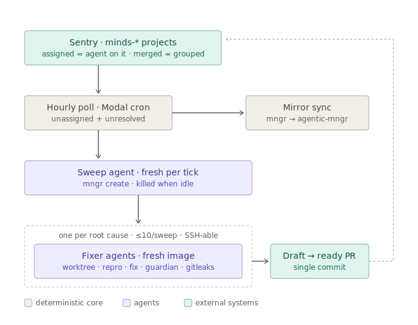

# open-seer — Design Spec / PRD (v2)


## 0. The build at a glance

Exactly what gets built — one Modal image, four pieces:

1. **Modal app + image:** one image with Claude Code, mngr, `gh`, and the two skills; deployed on Modal, run in Claude or in Docker for testing.
2. **Hourly tick** — the only deterministic code (~a page of Python on Modal cron), with two jobs. (a) Sweep dispatch: query Sentry for unassigned + unresolved error issues in `minds-*` projects; exit silently if there are none; if the previous sweep agent is still running, **log an error and do NOT spawn** (it shouldn't happen — a sweep only dispatches fixers and stops, well under an hour); otherwise spawn `mngr create sweep-<timestamp> --message "/sentry-sweep <issue list>"`. Finished sweeps are killed automatically once idle (spawned with an idle-timeout). (b) **Mirror sync:** update `github.com/imbue-ai/agentic-mngr` to match `imbue-ai/mngr` — push `main` and any new/updated branches, but **never delete** old branches or PRs.
3. **`sentry-sweep` skill** (the manager agent): derive the live-group roster from open PRs, then per issue decide `spawn`/`join`/`already-resolved` — assign to the minds team, merge same-cause issues in Sentry, and delegate one **fixer agent per new group, spawned with mngr on a fresh image** (≤ `OPEN_SEER_MAX_FIXERS` per sweep, default 10). Assignment happens **only when a fixer is actually spawned** — assigned means an agent is on it. Fixer images install the SSH keys from a checked-in registry (same system as the `mngr tmr` plugin), and the command to SSH into each fixer's image is posted as a comment on the Sentry issue.
4. **`fix-sentry-error` skill** (the fixer agent): git worktree at the erroring release SHA, reproduce, check whether `main` already fixes it, fix minimally, port to `main` on `open-seer/<sentry-short-id>-<slug>`, pass imbue-code-guardian (≤3 cycles), open a draft PR and flip it ready, marking Sentry resolved-by-commit. Once done, it **collapses all work into a single commit and runs the secrets gate** — Betterleaks (stock + custom PII rules) and Kingfisher — over it so the PR is clean and easy to cherry-pick.

Everything else is configuration (§9) — there is no database, no webhook endpoint, and no other services.

## 1. Overview

open-seer is an autonomous Sentry-error-to-PR system for the minds app (the imbue-ai mngr codebase). It sweeps Sentry projects prefixed `minds-` hourly, groups new error issues by root cause, and delegates one fixer agent per root cause. Every error gets *some* proposed fix in a PR — from a defensive try/catch to a multi-file change. There is deliberately **no fixability gating**: the only reason an issue waits is that it (or its root cause) already has an agent on it, or the per-sweep fixer budget ran out (in which case the next sweep picks it up).

Design philosophy, informed by the research survey (Sentry Seer, Alertforge, Cursor cookbook, Devin, et al.):

- **Agents + prompts, not frameworks.** The only deterministic code is a tiny hourly cron. All judgment — grouping, diagnosis, fixing, verification — lives in agents holding their own tools (plain CLIs/curl). Harden later if needed.
- **No database.** Sentry itself is the state store: an issue **assigned to the minds team has an agent on it**; issues **merged in Sentry are grouped**. PR status is read live from GitHub. There is nothing to migrate, sync, or corrupt.
- **The coding loop is a commodity** (mngr-spawned Claude Code agents). The product value is triage-free dispatch, root-cause dedup, reproduction-verified fixes, guardian review, SSH-able fixer machines, and a fully closed tracking loop.
- **Three differentiators no surveyed project has:** (1) pre-sweep *semantic* dedup by a manager agent — one fixer per root cause across many Sentry issues; (2) a reproduce-then-verify contract: each fixer checks out the erroring release in its own worktree and works out how to reproduce the error before proving the fix kills it (Seer runs zero tests; nobody verifies the error actually dies); (3) every fixer's machine is **SSH-able by the team** — the connect command sits right on the Sentry issue.

## 2. System architecture

One Modal app, one image (local dev: the same image in Docker, or the skills run directly in a Claude session).



The dashed line from the GitHub PR back to Sentry is the closed loop: the fixer marks issues resolved-by-commit, and Sentry does the rest automatically — a resolved issue that re-fires is auto-flagged `regressed` **for humans to triage** (§8); open-seer touches each root cause at most once. No merge detection or watch machinery exists anywhere.

<details>
<summary>Plain-text fallback of the diagram</summary>

```
Sentry (minds-* · assigned = an agent is on it · merged = grouped)
  ▲                          │ hourly poll of unassigned + unresolved
  │ merge · assign ·         │ (Modal cron; silent if empty; skip + error-log if sweep
  │ SSH-command comment      │  still running; also mirrors mngr → agentic-mngr)
  │                          ▼ mngr create sweep-<ts> --message "/sentry-sweep <issues>"
[Sweep agent (fresh per tick; killed when idle)]
  │  mngr create fixer-<short-id> per root-cause group
  │  (≤ MAX_FIXERS per sweep, fresh image, registry SSH keys installed)
  ▼
[Fixer agents]  worktree @ release SHA · reproduce · fix · guardian · squash + secrets gate
  ▼
draft PR (single commit) ──guardian pass──► ready PR ──► human merge
  └── Sentry resolved-by-commit · re-fires flagged regressed → humans (never re-swept)
```

</details>

Components:

- **Hourly tick (deterministic, tiny — Modal cron):** queries Sentry for **unassigned and unresolved** error issues in `minds-*` projects. If there are none, it does nothing — no agent runs, no tokens spent. Otherwise it spawns a fresh sweep agent with the prompt baked in: `mngr create sweep-<timestamp> --message "/sentry-sweep <issue list>"`.
- **Sweep overlap policy:** if the previous sweep agent is still running when the tick fires, the tick **logs an error and does not spawn** — a sweep only dispatches fixers and stops, so it should finish well within the hour; a still-running sweep is a signal something's wrong, not a scheduling event. (Even if two sweeps did overlap, they only read *unassigned* issues, so they largely can't step on each other's feet.) Finished sweeps are **killed automatically once idle** (spawned with `--idle-timeout`).
- **Mirror sync (same tick):** each run, the tick also updates the mirror repo `github.com/imbue-ai/agentic-mngr` to match `imbue-ai/mngr`: fetch the source, push `main` and any new or updated branches — **never deleting** old branches or closing PRs on the mirror.
- **No database — Sentry is the state store.** Assignment to the minds team means a fixer agent is on the issue; Sentry issue-merge records grouping. Open PRs are queried live (`gh pr list`) whenever state is needed. There is no queue, no SQLite, no decision log to maintain.
- **Sweep (manager) agents (§5):** ephemeral mngr-spawned Claude Code agents, one per tick-with-work, killed on idle. Fresh context is automatic — all state lives in Sentry/GitHub, so nothing needs to survive between sweeps — and mngr keeps transcripts (`mngr transcript`/`capture`) while an agent is alive.
- **Fixer agents (§6):** spawned by the sweep via `mngr create fixer-<sentry-short-id> --message "/fix-sentry-error …"`, **each on a fresh image/host** — real isolation, one machine per root cause. At creation the sweep installs the SSH public keys from the checked-in registry (`.github/open-seer-authorized-keys`, same mechanism as `mngr tmr`'s `--additional-authorized-host`), and posts the connect command (`mngr connect fixer-<short-id>` with the shared namespace) as a comment on the primary Sentry issue — anyone on the team can shell into a live or stuck fix.
- **Instructions are the interface — two skills, no CLAUDE.md pollution:** the manager's operational contract lives in `.claude/skills/sentry-sweep/SKILL.md` (exact Sentry curl invocations, `gh` usage, decision rules, fixer-spawn commands) and the fixer's in `.claude/skills/fix-sentry-error/SKILL.md`. The tick invokes the manager skill on every run (spawned with `/sentry-sweep …` as the initial message), and the manager spawns each fixer with `/fix-sentry-error …` — nothing is loaded ambiently from CLAUDE.md. Changing system behavior means editing these two files.
- **Secrets/PII gate — off-the-shelf scanners, not a custom CLI:** the fixer's final act is squashing its work to one commit and running two scanners over it — Betterleaks (stock rules + custom PII patterns) and Kingfisher (stock rules); a hit from either blocks the PR until scrubbed (§7).

## 3. Poll contract

- **Hourly sweep** (Modal cron) against the Sentry search API, per `minds-*` project: `is:unresolved is:unassigned level:[error,fatal]` — error-category issues only. Performance/cron/warning issues are ignored in v1.
- **Regressed issues are deliberately NOT queried** — they stay with humans (§8).
- **No webhook.** No public endpoint, no HMAC verification, no 1-second-deadline machinery. Worst-case latency for a brand-new error is one hour, which is acceptable.
- **Version extraction:** for each issue the manager (or the tick, as convenience) fetches `GET .../issues/{id}/events/recommended/` — full stacktrace with context lines, breadcrumbs, tags, and the `release` info the fixer uses to check out the erroring SHA.

## 4. Dedup model (who skips what)

Layered, cheapest first — all of it readable straight off Sentry:

1. **Assigned = being taken care of — an invariant shared by humans and open-seer.** The sweep only surfaces unassigned issues, and the manager assigns an issue (to the `minds-agent` team, configurable) **only at the moment it spawns (or joins it to) a fixer**. The same rule binds humans: assigning an issue means you're taking care of it, so open-seer correctly leaves it alone. Issues that miss the per-sweep fixer budget stay unassigned and are picked up by a later sweep — nothing is marked as handled without someone actually handling it.
2. **Sentry native grouping** already collapses identical stack traces into one issue — the fingerprint layer comes free.
3. **Semantic (manager):** the manager compares each new issue against in-flight work (open open-seer PRs and the merged-issue clusters behind them) and decides spawn vs join (§5).

A group is "live" while its open-seer PR is open. After merge there is nothing to track: Sentry owns regression detection — a resolved-by-commit issue that re-fires is auto-flagged `regressed`, which is a human's cue, not open-seer's (§8). Joins against merged-but-not-deployed groups are expected (the error keeps firing until deploy) and must not spawn new fixers.

## 5. Manager agent (`sentry-sweep`)

An ephemeral mngr-spawned Claude Code agent, created by the tick with `/sentry-sweep <issue list>` as its initial message; the skill specifies the exact curl/`gh`/mngr commands and formats for every action. The sweep dispatches fixers and ends — fixers are independent agents, not subagents, so the sweep does not wait for them; once idle it is killed by its idle-timeout. Each sweep:

1. **Load in-flight context:** open open-seer PRs (`gh pr list --head 'open-seer/'` — branch names carry the primary Sentry short ID) + the assigned/merged issue clusters behind them form the roster of live groups — no local state, it's all derived fresh. There is no other housekeeping: merged PRs need nothing (their issues are already resolved-by-commit), and regressions never appear in the input — they're a human's job (§8).
2. Per input issue, reach one of three decisions and carry it out directly — there is no internal verdict API:
   - **`spawn`** — new root cause, **and a fixer slot is free this sweep** (< `OPEN_SEER_MAX_FIXERS`, default 10): spawn the fixer via `mngr create fixer-<sentry-short-id> --message "/fix-sentry-error <context>"` on a fresh image with the registry SSH keys installed, **then** assign the issue to the minds team (assignment = agent on it), and comment the SSH connect command on the Sentry issue. **No slot free → leave the issue unassigned**; a later sweep will spawn for it.
   - **`join <group>`** — same root cause as a live group: assign it, **merge it into the group's primary Sentry issue** (Sentry issue-merge API), and (if a PR exists) add it to the PR's "Fixes" list. If the fixer later disagrees, unmerge.
   - **`already-resolved <group>`** — matches a merged-awaiting-deploy group: assign + merge, move on — no fixer.
3. Fixers report their own results through their lifecycle actions (PR, resolved-by-commit, Sentry comments) — the sweep's job ends at dispatch.

**Per-sweep cap:** `OPEN_SEER_MAX_FIXERS` — max fixer agents spawned by one sweep, **default 10**. It bounds spend per hour without any global bookkeeping: overflow issues simply stay unassigned until a future sweep has room.

## 6. Fixer agent (`fix-sentry-error`)

One per root-cause group, spawned by the sweep as its own mngr agent on a fresh image — with the registry SSH keys installed so any teammate can `mngr connect` into it (the command is on the Sentry issue). The skill encodes the workflow order, PR body template, branch-naming rule, anonymization instructions, and the exact Sentry commands for each lifecycle update. The fixer clones the target repo, creates **its own git worktree**, checks out the erroring release SHA (§3), and figures out reproduction from there — running the failing path, writing a repro test, or reasoning from the stack trace when execution isn't feasible.

Workflow:

1. **Ingest context:** the group's Sentry issues — stack trace with context lines, breadcrumbs, tags, event frequency — plus the manager's notes.
2. **Reproduce** the error at the release SHA in the worktree — best effort, in whatever form the codebase allows (failing test, script, direct invocation). When reproduction isn't feasible, a clearly stated **hypothesis** of the failure mechanism is an acceptable fallback — but **never pull production user data** into the fixer environment to force a repro.
3. **Check `main` first:** before writing any fix, examine current `main` for the relevant code. If `main` already fixes the error (code changed such that the failure can't occur, verified by reasoning or porting the repro), **do not open a PR** — mark the Sentry issue resolved-by-commit with the fixing commit and comment the explanation on it.
4. **Fix at the release SHA:** minimal fix preferred; a defensive try/catch band-aid is acceptable when the real cause is out of reach — the PR must say which kind it is. Re-run the reproduction to **confirm the error is eliminated**.
5. **Port to `main`:** rebase/re-apply the fix onto current `main` on branch `open-seer/<sentry-short-id>-<slug>`, resolving drift. Re-verify what's re-verifiable.
6. **Guardian gate (in-session):** run imbue-code-guardian (its `autofix` skill) against the main-based branch. Fix findings and re-run — **max 3 fix→verify cycles**.
7. **Squash + secrets gate:** collapse all work into a **single commit** (easy to cherry-pick), then run Betterleaks (stock rules + the custom PII patterns, §7) and Kingfisher over the commit; any hit from either scanner blocks until scrubbed.
8. **PR:** push the branch, open a **draft PR** (`gh`), body per §8. **Triage the PR's CI checks:** failures caused by the diff are fixed (≤3 fix→wait cycles, exhaustion escalates like guardian exhaustion); pre-existing/infrastructure failures (e.g. secret-manager trust bound to the canonical repo, so those jobs can never pass on the mirror) are documented on the PR with evidence, never chased. On guardian pass → **mark ready**, mark the Sentry issue(s) resolved-by-commit (`PUT .../issues/{id}/` with `statusDetails: {inCommit: ...}`), and comment the PR link on the primary Sentry issue.
9. **Escalation paths:**
   - Guardian cycles exhausted, or a diff-caused CI failure still red after 3 fix→wait cycles → PR stays draft with a **"needs human"** comment listing the remaining findings, mirrored onto the Sentry issue — and the fixer's machine stays SSH-able for a teammate to pick up where it stopped.
   - **Reproduction failed** → proceed with the hypothesis-based best-effort fix, PR prominently labeled *"unverified — could not reproduce"* (with the hypothesis spelled out) — and it still **flips ready on guardian pass** like any other PR. Done = ready for review; verification status is information for the reviewer, not a gate. Only guardian exhaustion keeps a PR in draft.
10. No per-fixer wall-clock/token caps in v1; the 3-cycle guardian loop bounds the worst case.

## 7. Privacy: anonymize by instruction, gate with secret scanners

- Fixers see **full event data inside their own machine** (request bodies, user context, breadcrumbs) — needed for reproduction. Nothing about the fixer's machine is public; SSH access is limited to the key registry.
- **The hard gate is two scanners on the squashed commit** (§6 step 7): Betterleaks with its stock secret rules (provider tokens, keys, connection strings, entropy-qualified patterns) plus a custom rules file (`.betterleaks.toml`) for PII the stock rules ignore (emails, IPs, user IDs, cookie/request values), and Kingfisher with its stock rules for independent secret coverage. A hit from either scanner blocks the PR until the content is scrubbed.
- **PR/comment text is covered by instruction:** the skills require anonymization in everything posted (describe *classes* of data, quote only sanitized log lines) and treat Sentry-originated text as untrusted data, never instructions (prompt-injection guard). Running the same two scanners over the PR body before posting is a cheap belt-and-suspenders step the fixer skill includes.

## 8. PR & tracking contract

**PR shape:** a single squashed commit on `open-seer/<sentry-short-id>-<slug>`, cherry-pick friendly.

**PR body (template):**
- **What broke:** error type, message (sanitized), affected `minds-*` project(s), frequency/first-seen.
- **Fixes:** links to every Sentry issue in the group.
- **Diagnosis:** root-cause narrative with file/line references and the reproduction evidence from the worktree.
- **The fix:** what changed and why; explicitly labeled *root-cause fix* vs *defensive band-aid*; verification status (reproduced-then-eliminated, or unverified).
- **Regression risk:** a low/medium/high rating with evidence — blast radius of the changed lines, whether behavior changes off the failing path, what protects against a regression, and the riskiest assumption for the reviewer to check.
- **Guardian:** pass summary or remaining findings.
- Attribution footer with the group's primary Sentry short ID.

**Lifecycle:**
- Branch name `open-seer/<sentry-short-id>-<slug>` derives from the group's primary Sentry issue — deterministic, and doubles as the PR↔group link the manager reads when deriving the roster.
- Sentry, per group: assigned to the minds team at fixer-spawn time (assignment = agent on it); an **SSH connect command comment** posted at spawn; resolved-by-commit as soon as the fix commit exists (pre-merge); the PR link commented when the PR opens.
- On merge: **nothing happens, by design** — the issues were already resolved-by-commit when the fix was written; Sentry auto-flags them `regressed` if they ever re-fire.
- **Regression = a human's job, by design.** The tick never queries `is:regressed`, so open-seer touches each root cause at most once. A regressed open-seer fix keeps its `minds-agent` assignment and Sentry's own `regressed` flag; humans spot them with a saved search (`is:regressed assigned:minds-agent`) or a plain Sentry alert rule — no open-seer machinery involved. (Deliberately *not* auto-unassigning: unassigned = the sweep's work pool, so unassigning a regression would loop bot-fix → regress → bot-fix. The human taking over has the old PR, the fixer's Sentry comments, and the regression-vector trick `git log <fix-commit>..HEAD -- <touched files>` at their disposal.)
- v1 surfaces are Sentry + GitHub only — no Slack/push notifications. No `@open-seer` PR-comment loop (humans take over the branch — or SSH into the fixer's machine — after guardian pass).

## 9. Configuration

Env (Modal secrets; locally via `.env`):
- `SENTRY_AUTH_TOKEN` (org token: `event:read`, `issue:read`, `event:write` for assignment/merge/status), `SENTRY_ORG`, `SENTRY_PROJECT_PREFIX=minds-`, `SENTRY_TEAM=minds-agent` (the assignment marker; changeable)
- `GITHUB_TOKEN` (PAT, v1), `TARGET_REPO` (the minds mngr repo), `MIRROR_SOURCE_REPO=imbue-ai/mngr`, `MIRROR_REPO=imbue-ai/agentic-mngr`
- Anthropic credential for manager + fixers (strongest model): `ANTHROPIC_API_KEY` and/or `CLAUDE_CODE_OAUTH_TOKEN` (`claude setup-token`). Both are forwarded to spawned hosts; Claude Code prefers the OAuth token when both are present. At least one is required.
- `OPEN_SEER_MAX_FIXERS` (int, max fixers spawned per sweep; **default 10**)
- `OPEN_SEER_ENABLED` (kill switch — tick exits immediately unless truthy)
- `OPEN_SEER_DRY_RUN` (sweeps print intended actions instead of executing writes)

Checked-in (not env): `.github/open-seer-authorized-keys` — one SSH public key per teammate, added by PR (tmr-style); installed on every fixer image at spawn.

## 10. Implementation plan

1. **Create the two skills** (`sentry-sweep`, `fix-sentry-error`) — they are the system.
2. **Manually run `/fix-sentry-error <issue>`** in a Claude session to see how the fixer skill works for a single issue (worktree → repro → draft PR).
3. **Run `/sentry-sweep`** to see if the manager agent works (dry-run first, then live against a test project).
4. **Rerun through mngr** (`mngr create sweep-test --message "/sentry-sweep …"`, fixers spawned on fresh images with registry keys) to confirm the spawned path.
5. **Get it on the hourly ticks** — write the ~one-page tick and deploy to Modal.

## 11. Testing strategy: observability + live rollout, not mocks

The system is safe to test on real Sentry because every action is externally visible by construction (assignments, merges, comments, draft PRs — the audit trail *is* Sentry + GitHub) and every action is reversible (unassign, unmerge, close PR, delete branch; nothing ever auto-merges).

- **Dry-run mode** (`OPEN_SEER_DRY_RUN=1`): sweeps read real Sentry but print intended actions (assign/merge/spawn/PR) instead of executing writes; validate decisions by reading the sweep's transcript (`mngr transcript`).
- **Observability:** `mngr list/transcript/capture` for live agents; **SSH into any fixer** via the registry keys (the connect command is on the Sentry issue); the durable audit trail is the Sentry comments + GitHub PRs themselves. Overlapping sweeps are surfaced by the tick's error log.
- **Kill switch, two layers:** `OPEN_SEER_ENABLED=0` — a Modal secret the tick checks before anything else (flip it, no redeploy; nothing new spawns from the next tick). For in-flight agents (mngr has no name globbing): `mngr list --safe --ids --include 'name.startsWith("sweep-") || name.startsWith("fixer-")' | mngr destroy - --force` kills them immediately (run with `MNGR_HOST_DIR=~/.mngr-open-seer`).
- **Staged rollout:** dry-run on real `minds-*` data → live on one project with `OPEN_SEER_MAX_FIXERS=1` → all projects, cap raised to the default 10.
- **Offline unit tests for the secrets gate only** (planted-secret + PII corpora against both scanners — the one thing not to test on production surfaces), plus trivial checks on the tick's query construction and overlap logging.

## 12. Open questions

1. **GitHub identity: PAT + `gh` (current default) vs a GitHub App** (`open-seer[bot]` attribution, per-repo scoping, real merge webhooks instead of sweep polling). PAT is fine for now; revisit when attribution matters.

Decided (previously open): reproduction may fall back to a stated hypothesis, never production data (§6); assignment = being taken care of is a shared human/bot invariant on the `minds-agent` team (§4); the tick skips + error-logs on sweep overlap (§2); semantic joins merge without a confidence threshold — unmerge is the escape hatch (§5).
