# How Minds Gets Built, Signed, and Shipped

A field report on the build, packaging, CI, signing, and release pipeline of the minds desktop app.

- **Date:** 2026-07-06. This is a snapshot. If the prose and the citations ever disagree, trust the citations; if the citations and the code disagree, the code won.
- **Vantage point:** branch `danver/understanding-minds`, whose working tree says minds `0.3.4`. The newest release tag is `minds-v0.3.5`; this branch simply predates that bump, which is normal between releases.
- **Erratum (2026-07-22):** after the research date, `origin/main` was merged into this branch, bringing the 2026-07-10 rename of `forever-claude-template` (FCT) to `default-workspace-template` and releases through `minds-v0.3.8` (`FALLBACK_BRANCH` now sits at `templates.py:314`). The prose keeps its research-date names, versions, and line anchors; the schematic in Part 2 uses the current name. Where this report and the tree disagree, the tree won — as promised one bullet up.
- **Paths** are relative to the repo root.
- **Companion report:** [Where Design Intent Lives](2026-07-06-design-intent-landscape.md), which treats the general question of how this repo records intent. This report treats one subsystem: how the app ships.

## The short version

Minds is a deliberately thin Electron shell around a Python backend. There is no JavaScript framework and no bundler; the UI is server-rendered Jinja plus compiled Tailwind, and the only "compile" step in the whole frontend is CSS. The build, therefore, is mostly logistics: stage a private PyPI-in-a-folder (wheels for every workspace package, plus a regenerated lockfile), a portable toolchain (uv, git, Lima, restic, and a Node CLI), and per-tier client config into `resources/`, then hand the lot to **ToDesktop** — a commercial service that builds, code-signs, notarizes, hosts, and auto-updates Electron apps. The repo contains zero Apple credentials. This is on purpose, and it is the correct amount.

A release is a hand-run, nine-step procedure in `apps/minds/docs/release.md` that pins a *triple* — an mngr commit, a `forever-claude-template` (FCT) snapshot, and a ToDesktop build — under matching immutable `minds-v<version>` tags in two repositories. CI's job is to *prove* the triple works, up to and including launching the actual signed, notarized `.app` on real Macs twice a day. Humans make every *decision*: the version bump, the vendor sync, the merge, the tag push, and the final "Release" click in a web dashboard.

The design intent behind all of this is written down, mostly in exactly one place per topic, and mostly still true. The divergences that exist are real but concentrated in predictable places: narrative docs that lag the code, one alarming-but-obsolete audit sitting at the repo root, a small graveyard of orphaned tests, and a five-line style guide whose single rationale is stale. Part 4 has the full table.

## Part 1: What the team committed to

You can reconstruct a crisp set of design commitments from quotes in the tree — each stated in writing, in a file whose job is to state it. This section is the answer to "what design intent is clearly committed to."

**1. The shell is thin; the app is the Python backend.**
"The Electron shell is deliberately thin" (`apps/minds/docs/desktop-app.md:7`); "The desktop app wraps the existing Python backend -- no code changes are needed to the web UI or agent system" (`desktop-app.md:3`). The shell does four things — environment setup, backend lifecycle, auth handshake, window management — and the backend is spawned as a subprocess (`minds run --host 127.0.0.1 ...`), not embedded (`apps/minds/electron/backend.js:137-314`).

**2. Users need zero prerequisites; the bundle brings its own toolchain.**
"The desktop app bundles platform-specific binaries so users need zero prerequisites" (`desktop-app.md:99-100`). Concretely: uv, git, Lima (pinned to 2.0.3 to dodge a gvisor-tap-vsock regression, `apps/minds/scripts/build.js:18-30`), restic, and the latchkey CLI ship inside `resources/`; Python itself does *not* ship — the bundled uv downloads Python 3.12.13 and installs the shipped wheels into `~/.minds*/.venv` on first run, outside the read-only signed bundle (`apps/minds/electron/env-setup.js:64-72`, `backend.js:216-219`). Upgrades re-install the workspace wheels explicitly because "the user keeps running the OLD code in ~/.minds/.venv even after the signed .app bundle has been replaced" otherwise (`env-setup.js:37-43`).

**3. The Apple relationship is outsourced.**
"ToDesktop builds the macOS arm64 native installer (.zip / .dmg), handles code signing, notarization, and auto-update infrastructure" (`desktop-app.md:235`). In-repo, the signing surface is exactly: the entitlements file (`apps/minds/entitlements.mac.plist`) and a list of extra binaries for ToDesktop's signer to deep-sign (`limactl`, `restic` — `apps/minds/todesktop.js:12-18`). The Developer ID certificate and notarization credentials live in ToDesktop's cloud, under app id `26032588hqdzk`. The only signing-adjacent CI secrets are `TODESKTOP_ACCESS_TOKEN` and `TODESKTOP_EMAIL` (`.github/workflows/minds-launch-to-msg.yml:177-178`).

**4. Releases pin an immutable triple.**
"Pin to an annotated FCT tag so a shipped binary clones the exact FCT snapshot it was verified against" (`apps/minds/imbue/minds/desktop_client/templates.py:282-284`, the comment above `FALLBACK_BRANCH`); "tag immutability pins a binary to the snapshot it was verified against" (`apps/minds/docs/release.md:11`). A shipped binary, the FCT template it clones at runtime, and the pre-baked Lima image all key off the same `minds-v<version>` tag.

**5. Verification by reproduction, not review.**
The FCT repo vendors a full copy of this monorepo at `vendor/mngr/` (a plain snapshot, not a submodule — `apps/minds/docs/vendor-mngr-sync.md:9-11`). Releases regenerate it with `git archive` from the exact tagged SHA, and: "The vendor/mngr snapshot (thousands of files) is generated and verified by reproduction, not by reading ... A clean comparison is the review" (`release.md:26`). The invariant is stated plainly: "FCT vendor/mngr must be the git archive of the exact mngr SHA it's paired with ... If they diverge, the agent's mngr can mismatch the binary's API" (`release.md:22`).

**6. CI is a surface, not a gate.**
"Neither `main` is branch-protected, so a PR is never a merge gate ... opening a PR is how you get traditional CI on a release branch" (`release.md:13`). Review is explicitly social: "even that review is social, not a gate" (`release.md:101-103`). What actually gates a release is enumerated at `release.md:51-61`: the end-to-end launch proof, the FCT test job, and the vendor-match comparison — "no test asserts the version literal or that `FALLBACK_BRANCH` resolves to an existing tag."

**7. Supply-chain paranoia, tuned rather than absolute.**
pnpm refuses any dependency published less than 14 days ago — "so a freshly-compromised release cannot be pulled into a build ... before it has had time to be noticed and yanked" (`desktop-app.md:210-211`, `apps/minds/pnpm-workspace.yaml:10-13`) — with exceptions only for Imbue's own packages. A `supportedArchitectures` block forces pnpm to materialize *every* platform's native prebuilds so ToDesktop's single build host can't ship a builder-only binary set (`pnpm-workspace.yaml:15-26`).

**8. Operational tasks get named, auditable entry points.**
"The root `justfile` is the canonical, auditable, named home for every operational minds task ... If no recipe fits, ADD one" (`.claude/skills/minds-justfile/SKILL.md:8,18-34`). The rationale: hand-rolled invocations "drift, leak secrets, and miss steps."

That is a coherent design philosophy: keep the shell dumb, outsource the parts with credentials, pin everything to immutable tags, prove by running rather than reading, and put humans at the decision points. The rest of this report checks how faithfully the implementation follows it.

## Part 2: The pipeline as built

First, the schematic. The `dot` block below is the committed diagram — the local pandoc pipeline renders it as an image in the PDF via its graphviz filter, while on GitHub you get the grep-able source:

```dot
digraph minds_ship_path {
    rankdir=LR;
    newrank=true;
    labelloc="t";
    label="minds: source to running app (schematic, 2026-07-06)";
    fontname="Helvetica";
    fontsize=13;
    node [shape=box, style="rounded,filled", fillcolor="white", color="#607080", fontname="Helvetica", fontsize=10, margin="0.18,0.12"];
    edge [color="#607080", fontname="Helvetica", fontsize=9];

    subgraph cluster_dev {
        label="developer machine (mngr monorepo)";
        style="filled"; fillcolor="#E8F0F7"; color="#9DB4C8";
        "minds source" [label="apps/minds\nthin Electron shell + Python backend\n(server-rendered Jinja UI)"];
        "release pins" [label="release pins (step 1, human)\npackage.json version +\nFALLBACK_BRANCH in templates.py"];
        "build.js" [label="pnpm build (scripts/build.js)\nstages resources/: uv, git, Lima, restic,\nlatchkey, 16 wheels + regenerated uv.lock,\nper-tier client.toml"];
    }

    subgraph cluster_pin {
        label="release pinning (release.md, human-run)";
        style="filled"; fillcolor="#F3EEE3"; color="#C9BC9C";
        "mngr tag" [label="mngr repo\nannotated tag minds-vX\non the verified SHA"];
        "template tag" [label="default-workspace-template repo\n(formerly forever-claude-template)\nvendor/mngr = git archive of that SHA\nannotated tag minds-vX"];
    }

    subgraph cluster_td {
        label="ToDesktop cloud (vendor holds the Apple identity)";
        style="filled"; fillcolor="#EFE8F5"; color="#B7A6CB";
        "sign and notarize" [label="build + codesign + notarize\nentitlements.mac.plist,\ndeep-signs limactl and restic"];
        "latest channel" [label="hosted builds (dl.todesktop.com)\nlatest channel serves auto-updates"];
    }

    subgraph cluster_ci {
        label="GitHub Actions (verification, never the ship button)";
        style="filled"; fillcolor="#E9F3EA"; color="#9CBFA1";
        "snapshot suite" [label="ci.yml, every PR:\nsnapshot-resume suite drives\nreal Electron (xvfb), chat round-trip"];
        "launch-to-msg" [label="minds-launch-to-msg.yml\n(twice daily + release dispatch):\ninstalls the signed .app on real Macs,\nproves launch to first message"];
    }

    subgraph cluster_user {
        label="user's Mac (arm64)";
        style="filled"; fillcolor="#F7ECEC"; color="#CBA3A3";
        "Minds.app" [label="Minds.app\n(@todesktop/runtime auto-update)"];
        "backend venv" [label="first run: bundled uv fetches\nPython 3.12, installs the wheels\ninto ~/.minds/.venv, spawns minds run"];
        "agent workspace" [label="agent workspace (Lima VM / Docker)\nclones the template at the\nFALLBACK_BRANCH tag (optional prebaked\nLima image, minisign-verified, from R2)"];
    }

    { rank=same; "sign and notarize"; "latest channel"; }
    { rank=same; "Minds.app"; "backend venv"; "agent workspace"; }

    "minds source" -> "build.js";
    "minds source" -> "snapshot suite" [style=dashed, label="every PR"];
    "minds source" -> "template tag" [style=dotted, label="dev loop only: rsync of the\nworking tree (just minds-start)"];
    "release pins" -> "mngr tag" [label="bump, merge\n(merge commit, never squash)"];
    "mngr tag" -> "template tag" [label="just sync-vendor-mngr\n(ls-tree compare proves the match)"];
    "build.js" -> "sign and notarize" [label="pnpm dist\n(todesktop build)"];
    "sign and notarize" -> "launch-to-msg" [label="artifact under test,\nbuilt from THIS SHA"];
    "launch-to-msg" -> "latest channel" [style=dashed, label="green e2e gates step 9:\na human clicks Release"];
    "latest channel" -> "Minds.app" [label="auto-update / download"];
    "Minds.app" -> "backend venv";
    "backend venv" -> "agent workspace";
    "template tag" -> "agent workspace" [label="cloned at runtime\n(pinned, immutable)"];
}
```

### The dev loop

`just minds-start` (justfile:416) is the entry point. Every startup, it rsyncs your *working tree* of mngr into the FCT checkout's `vendor/mngr/` (uncommitted changes included), exports operator-mode env vars, and runs `pnpm start`, which launches Electron directly against the monorepo's uv workspace — no `uv sync`, no wheels, Python edits picked up on restart (`desktop-app.md:218-226`). The dev-workflow skill is emphatic that "the vendor/mngr/ sync must happen BEFORE every Create" (`.claude/skills/minds-dev-workflow/SKILL.md:30`) — the running agent imports the vendored copy, so a stale vendor means your changes silently don't exist inside the container. `just propagate-changes <agent>` pushes edits into an already-running container.

There are two vendor-sync mechanisms with one table explaining when to use which (`vendor-mngr-sync.md:22-24`): `git archive` (committed, exact SHA — releases) and `rsync` (working tree, no commit — dev). The rsync exclude rules live in one module (`pool_bake.py`) with four call sites that must stay in step.

### The packaged build (`apps/minds/scripts/build.js`)

`pnpm dist` is `pnpm build && pnpm exec todesktop build` (`apps/minds/package.json:15`). The local half, `build.js`, stages everything into `resources/` in a fixed order (`main()` at `build.js:590-619`): clean; download uv/Lima/git/restic in parallel; compile Tailwind; bundle latchkey (run as Node via the Electron binary with `ELECTRON_RUN_AS_NODE=1`); build a wheel for each of the sixteen workspace packages (`WORKSPACE_PACKAGES`, `build.js:48-65`); rewrite the packaging shim's `[tool.uv.sources]` to point at those wheels and regenerate the shipped lockfile with a real `uv lock` — "uv emits the exact right shape for wheel-path sources itself" (`build.js:585-586`); bake the tier's `client.toml` and `root_name` into *both* the source tree and `resources/pyproject/.../_bundled/` (the second copy exists because Electron's asar archive isn't readable by the Python side, `build.js:527-545`); stamp the git SHA into `electron/build-info.json`.

Two details worth savoring. First, every workspace package is a *direct* dependency of the packaging shim because "uv ignores source overrides for transitive-only packages and falls back to PyPI, which silently installs stale published versions instead of our freshly built wheels" (`apps/minds/electron/pyproject/pyproject.toml:6-8`) — a sentence that has clearly been paid for. Second, `build.js:390-401` strips Lima's `lima-guestagent.Darwin-*.gz` payloads before upload, because Apple's notarytool unzips them and rejects the unsigned inner binary. Someone learned that from a rejected notarization, and now it's a comment.

The wheel strategy also carries its own executable guard: two acceptance-marked tests in `apps/minds/scripts/build_test.py` build every workspace wheel with the real toolchain and assert each is pure Python (`py3-none-any`) and ships no test files — because "the build is single-platform and the wheel is shipped to all platforms as-is" (`build_test.py:1-16`).

Version pinning is strict throughout: `node 24.15.0` and `pnpm 10.33.4` exactly, enforced by `engine-strict=true`; Electron 40.10.1; the app version lives in `apps/minds/package.json:4` and nowhere else.

One gap against commitment #8: `pnpm dist` — the actual "build the shippable thing" command — is *not* wrapped in a justfile recipe. `minds-build` runs only the `resources/`-staging half. The canonical-entry-point rule stops one step short of the most consequential command.

### Signing and notarization

Happens entirely inside ToDesktop's cloud when `todesktop build` uploads the app. A grep of `.github/` for `CSC_`, `APPLE_`, `notar`, `codesign`, `DEVELOPER_ID` turns up two prose comments and zero credentials; there is nothing to leak. The repo's contribution is `entitlements.mac.plist`: hardened-runtime carve-outs (JIT, unsigned executable memory, dyld environment variables, library validation off — the price of shipping other people's binaries inside your signature), media-device permissions, and the tell: `com.apple.security.virtualization`, which is what lets the bundled `limactl` boot VMs on Apple's Virtualization framework. One more private key exists in the pipeline — the minisign key that signs pre-baked Lima images — and it deliberately never enters the repo or CI: "the R2 credentials and the minisign signing private key stay on your machine; only a public URL + public key are committed" (`release.md:160`).

### The release procedure

`release.md` (210 lines) is the runbook, and the `release-minds` skill is twelve lines that say, in effect, "the procedure lives in release.md; this skill only routes you there." The condensed shape:

1. **Bump** `package.json` version and `FALLBACK_BRANCH` to `minds-v<X>` — a tag that does not exist yet (steps 4's `template_ref` override is why that's fine).
2. **Open PRs on both repos** — purely to get CI, since main is unprotected.
3. **Regenerate FCT `vendor/mngr`** from the green mngr SHA via `just sync-vendor-mngr` (commits locally, prints the push line, refuses a dirty FCT).
4. **Prove the pair** by dispatching `minds-launch-to-msg.yml` against the release branches — the long pole.
5. **Review real code only** (a version bump and a generated vendor snapshot get none; "A clean comparison is the review").
6. **Merge with a merge commit, never a squash** — so the verified SHA stays reachable from main — then verify FCT main's `vendor/mngr` tree-matches the tagged mngr SHA via a `git ls-tree` blob-hash comparison.
7. **Tag the verified SHA, never main HEAD** — annotated `minds-v<X>` tags on both repos, pushed with a `weishi-imbue` token. The doc cites the incident that produced this rule: main HEAD once sat 58 files past the tagged SHA (`release.md:127-144`).
8. **Re-run launch-to-msg against the two tags.** "Green here concludes the release."
   - **8b.** Build and publish the pre-baked Lima image (operator's machine, minisign + R2). Optional; clients "back off to building in-VM" if absent.
9. **Ship:** click **Release** in the ToDesktop dashboard (the `todesktop release` CLI is auth-blocked). The auto-updater picks it up on next launch.

The tags are self-documenting: `minds-v0.3.5`'s annotation records the exact mngr and FCT SHAs it pairs. Eight releases exist (`minds-v0.2.3` through `minds-v0.3.5`), all tagged by the same person — see Part 5.

`release.md`'s git history shows six-plus correction commits, each fixing the doc to match observed reality ("branches not PRs", "tag the verified SHA", stale back-references). This is what a runbook looks like when people actually run it. It is the healthiest document in the pipeline.

### Distribution and updates

Users get the app from ToDesktop's CDN (`https://dl.todesktop.com/26032588hqdzk/builds/<build_id>/mac/zip/arm64`) — there is no GitHub release. Auto-update is `@todesktop/runtime`, initialized only in packaged builds with `updateReadyAction: { showInstallAndRestartPrompt: 'always' }` — the default `"never"` used to stage updates without ever telling the user (`apps/minds/CHANGELOG.md:233`, `apps/minds/electron/main.js:20-30`). A build serves no updates until the Release click promotes it to the `latest` channel; the in-app "Check for Updates" says as much (`main.js:2416`). macOS arm64 only: `todesktop.js` has a single `mac` block, and the docs are explicit that Linux and Windows "are not currently wired up" (`desktop-app.md:228-235`).

## Part 3: What actually tests this

The repo's four-tier test taxonomy (unit `_test.py` / integration `test_*.py` / `@pytest.mark.acceptance` / `@pytest.mark.release`, `style_guide.md:1731-1736`) applies to minds unevenly — see divergence 6 — but the pipeline itself is guarded by three real layers:

**Per PR.** `ci.yml` runs the offload unit/integration suite (~94 `_test.py` files for minds; coverage gate `fail_under = 70`, `apps/minds/pyproject.toml:147`), a real-Docker job, and — the interesting one — `build-minds-snapshot`/`test-minds-snapshot`: a Modal VM snapshot with a baked FCT workspace, against which six `minds_snapshot_resume` tests run, including `test_create_apikey_workspace_and_chat_via_electron`, which drives the *actual Electron app* under xvfb to create a workspace and round-trip a chat message (`apps/minds/test_snapshot_resume.py:510`). That job blocks every same-repo PR (fork PRs are skipped) unless the `DISABLE_MINDS_SNAPSHOT_CI` kill-switch variable is set (a value we can't see from the repo — an unknown worth resolving).

**Twice a day.** `minds-launch-to-msg.yml` (cron 16:00 and 04:00 UTC) is the crown jewel and the de facto release gate: job one runs a real `pnpm dist` — an actual ToDesktop sign-and-notarize, with build reuse keyed to the commit SHA and the pointed comment "Verify always runs against a bundle built from THIS SHA — no implicit fallback to released or arbitrary URLs"; job two installs the signed `.app` on a self-hosted MacBook, boots Lima workspaces, and asserts a nonce-verified chat round-trip plus a Slack permission flow; job three cold-launches the same artifact on a vanilla `macos-latest` runner and screenshots it. Green pairs are cached so unchanged (mngr, FCT) pairs skip; every run posts to Slack. The packaged, signed, notarized artifact is genuinely launch-tested — which the testing docs barely advertise (divergence 5).

**On demand.** Deployment tests (`apps/minds/deployment_tests/`) mint real ephemeral cloud environments (Modal + Neon + SuperTokens), assert deploy/rollback/destroy round-trips, and cost actual money; they run only via `workflow_dispatch` with `run_minds_release_tests=true`, or via `just minds-test-deployment*` recipes. Release-marked tests run in `release-tests.yml` on `v*` tags and daily via the TMR workflows — but note `v*` does not match `minds-v*`, so minds release tags deliberately trigger neither PyPI publishing nor the mngr release suite (correct namespacing, documented nowhere; divergence 10).

**The gaps.** The acceptance tier is nearly — not entirely — unused: eight acceptance-marked test functions exist under `apps/minds`, all in `_test.py`-named files (the style guide places acceptance tests in `test_*.py` files), and the important two are the wheel-contract guards described in Part 2; the other six exercise Docker state-container cleanup in the per-PR Docker job. Everything else the taxonomy would call acceptance-shaped is carried by the custom `minds_snapshot_resume` mark. A handful of JS tests are orphans: `pnpm test:unit` (7 startup-routing cases) and two renderer-contract Playwright specs are wired to no workflow and no recipe, and `test/e2e/README.md` refers to a `chat-roundtrip.spec.js` that does not exist. The AWS/gVisor release test self-skips unless `MNGR_AWS_RELEASE_TESTS=1`, which no CI job sets — it is effectively dormant.

## Part 4: Where the map disagrees with the territory

The divergences, localized. None of them are load-bearing failures; all of them are legibility failures.

| # | Where stated | What it says | What is true | Weight |
|---|---|---|---|---|
| 1 | `ELECTRON_BUNDLING_AUDIT.md` (repo root, 2026-05-18) | "The packaged Electron app almost certainly cannot start today" (two CRITICAL findings) | Both findings have since been fixed (`build.js:527-545` stages bundled config; `:557-588` builds wheels and regenerates the lockfile), and the packaged app is launch-tested twice daily. The audit also cites `todesktop.json`, renamed to `todesktop.js`. | **High.** A confident, obsolete "the product is broken" document at the repo root is the single worst intent artifact in the tree. Archive or delete it. |
| 2 | `desktop-app.md:237` | dev-time `electron/pyproject/uv.lock` "is not committed" | It is git-tracked. The surrounding point (only the regenerated lockfile ships) is correct. | Low. |
| 3 | `desktop-app.md:249-271` (file-structure section) | `build.js` "downloads uv/git/lima, copies pyproject to resources/" | Predates wheels, CSS, latchkey, restic; the same doc's build section 12 lines earlier is accurate. | Low-medium: the doc disagrees with itself. |
| 4 | root `CLAUDE.md` | "Release tests do *not* run in CI." | `release-tests.yml` runs them on dispatch and `v*` tags; TMR runs them daily (`style_guide.md:1858`). True only as "never per-PR, never a merge gate." | Medium: agents plan work from CLAUDE.md. |
| 5 | `testing-overview.md:102-104` | Mentions launch-to-msg in passing | It is a three-job pipeline that signs, notarizes, installs, and exercises the real artifact twice daily — the strongest guarantee the pipeline has. | Medium: the best fact is buried. |
| 6 | `style_guide.md:1735` | Acceptance tests live in `test_*.py` files and "run on all branches in CI" as a tier | Minds has exactly eight acceptance-marked test functions, all in `_test.py`-named files, contrary to the placement rule; the per-PR e2e role is filled by the custom `minds_snapshot_resume` mark instead. | Low as behavior, medium as legibility: the taxonomy and the practice speak different dialects. |
| 7 | `package.json:17-18`, `test/e2e/README.md` | `test:unit`, `test:e2e`, `chat-roundtrip.spec.js` | First two invoked by nothing in CI or the justfile; the third doesn't exist. | Low-medium: silent rot at the edges. |
| 8 | `release.md:13,156` | Green CI on the tags "concludes the release"; the Release click is an "optional follow-up" | Users receive nothing until the click; the updater is disabled until the build hits the `latest` channel (`main.js:2416`). Verification concludes; distribution does not. | Low: correct if read carefully, cheerfully misreadable. |
| 9 | `minds-launch-to-msg.yml:970` vs `minds-runner-reset.yml:26-28` | `/Applications/Minds.app` vs `/Applications/minds.app` | Case mismatch between workflows; a past real bug in this family is memorialized in the changelog. | Low. |
| 10 | `publish.yml`, `release-tests.yml`, `release.md` | Tag triggers fire on `v*` | `minds-v*` deliberately doesn't match — minds releases bypass PyPI publish and mngr release tests by design — but no doc states the two namespaces are disjoint on purpose. | Low-medium: correct-by-design, undocumented. |

The pattern: divergence lives in *narrative* artifacts (overviews, file-structure sections, a point-in-time audit) and at *unwired edges* (orphan tests, casing between two workflows). It does not live in the enforced or exercised layers — the build scripts, the release runbook, the config — which are kept honest by, respectively, CI and use. The companion report generalizes this observation.

## Part 5: The human boundary

| Decision / action | Who or what does it |
|---|---|
| Version bump, vendor sync, merge, tag, push | Human (optionally an agent following `release.md`) |
| Code review of release branches | Human, social-only — explicitly not a gate |
| Build, sign, notarize, host, serve updates | ToDesktop's cloud, automatically |
| Prove the artifact works | CI (`minds-launch-to-msg.yml`), on dispatch and twice-daily cron |
| Per-PR regression proof | CI (`ci.yml`, including the real-Electron snapshot suite) |
| Lima image build + publish | Human, on their own machine, holding the minisign key |
| Ship to users | Human, clicking Release in the ToDesktop dashboard |

Which surfaces the bus-factor list: the `weishi-imbue` GitHub token (all eight release tags were pushed by one person, and `release.md:43` hard-codes the account with no succession note), access to the ToDesktop dashboard for app `26032588hqdzk`, the minisign private key on an operator laptop, and a self-hosted MacBook runner. None of this is documented as owned by anyone in particular — see the absences list in the companion report.

## Part 6: Where the pipeline's intent is written down

For the reader who wants the sources rather than this report's digest, in descending order of trustworthiness:

| Artifact | Topic | Lines | Condition |
|---|---|---|---|
| `apps/minds/docs/release.md` | The release procedure, gates, rationale | 210 | Excellent; actively corrected from incidents |
| `apps/minds/docs/vendor-mngr-sync.md` | The two vendor-sync mechanisms | 74 | Current; single source of truth, skills point here |
| `apps/minds/docs/desktop-app.md` | Shell architecture, packaging, dev vs packaged | 271 | Good, with two stale patches (divergences 2, 3) |
| `apps/minds/docs/testing-overview.md` | Test taxonomy and CI map | 285 | Good, understates the launch-to-msg pipeline |
| `justfile` (root) | Every operational entry point | 1061 | Good; sectioned, doc-commented, minds section at `:220` |
| `todesktop.js`, `package.json`, `pnpm-workspace.yaml`, `build.js` | Config-as-intent, with why-comments on every sharp edge | — | Excellent; the comments cite the incidents that produced them |
| `ELECTRON_BUNDLING_AUDIT.md` (root) | A 2026-05-18 audit of config bundling | 516 | Obsolete and alarming; should be archived |

What does *not* exist: a one-page "how the app ships" overview (until this report, the answer was assembled from five documents), and any statement of who owns the ToDesktop account, the Apple identity behind it, or the minisign key.

## Unknowns

Things this report could not determine from the repo: whether `minds-v0.3.5` was actually promoted to the `latest` channel (ToDesktop dashboard state); the current value of `DISABLE_MINDS_SNAPSHOT_CI`; the FCT repo's own CI internals (it is a different repository); and who administers the ToDesktop account. None of these are knowable from a checkout, which is itself a small finding: the last mile of the release lives entirely outside version control.

## Method

Researched 2026-07-06 by four parallel read-only research agents (build/packaging, CI/signing/release, testing, intent inventory) plus one adversarial verification agent that attempted to refute every specific claim above against the cited files. No code was modified; no builds were run.
